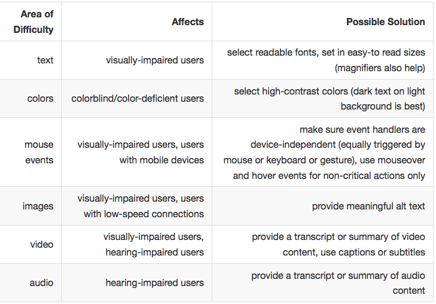

#Accessibility

---

##Accessible Rich Internet Applications(ARIA)

---

#What does it mean for something to be accessible?

---

---

#Things you can Do

- use alt tags on images
- use semantics the way that they're intended
- use keyboard inputs whenever possible
- add audio transcripts

---

ARIA Properties

- Aria was created to provide accessibility help in the modern era.[^1]

[^1]: http://www.w3.org/TR/wai-aria/

---

---

# But I'm creating a single page app?

---

# Set roles on things

is an input tag a `menuitem`?
is that the `main` part of your page?
is that html related to `search`?

---

# Use aria tags!
- use the `tabindex` property
- `aria-states` on inputs
- `aria-live`
