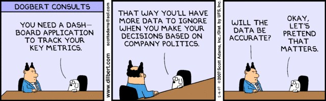
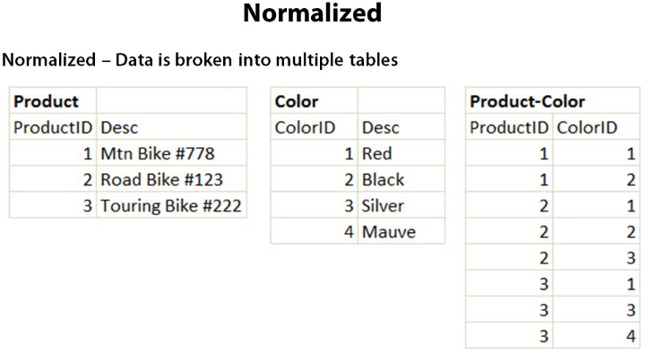
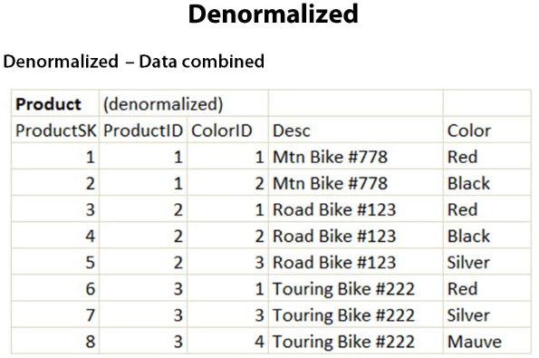

# DB optimizations


---


---

#Speeding up Querys

- Using Joins

---

```JS
Post.find({}, function(err, posts) {
  posts.forEach(function(post) {
    Comment.find({postId: post.id}, function(comments){
      // comment stuff
      post.comments = comments;
    });
  });
})
```

---
#This is a query that can be optimized, via an n+1 query

- eager loading
- ``` SELECT post.title, comment.body from posts JOIN comment ON comment.post_id=post.id```
- One query, loads all posts, and all their comments

---
#Normalised vs DeNormalised


---


- Nothing is repeated
- Different Table for each field

---



- pull your m-m relationships out of seperate tables, stick them in a denormalized one
- more duplication, higher speed


--- 
```SQL
CREATE TABLE data 
(
    id INT NOT NULL PRIMARY KEY, 
    data_status VARCHAR(1), 
    data1 VARCHAR(10), 
    data2 VARCHAR(10),
);
```

---

```SQL
CREATE TABLE data_main 
(
    id INT NOT NULL PRIMARY KEY,
    status VARCHAR(1),
    data1 VARCHAR(10)
);

CREATE TABLE data_rarely_used 
(
    id INT,
    data2 VARCHAR(10),
    FOREIGN KEY (id) 
      REFERENCES data_main (id) 
);
```

---

#DB sharding/Horizontal partitioning

- split your database up
- letters a-l in one db, l-z in another.

