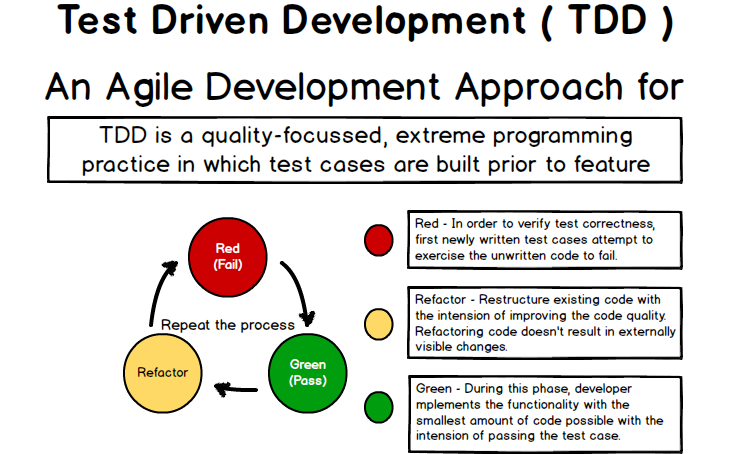

#Testing

---

---

---

#Why Test

- Ensures that your code will work
- as long as the tests pass
- forever

---

#Different Types of Testing

- Unit Test
- Feature Test

---

#What makes a good test?

- Isolated
- Descriptive

---

#TDD/BDD
##(test/behavior) driven development

- write the tests first
- ensures that they get written

---

---

#Parts of a test

- Arrange
- Act
- Assert

---

#Test smells

- Highly Coupled code
- Async code
- eager tests

^Code that cant be tested without another piece of code solution: mocking, doubling. Async code, use `done`. Code that tests too much

---

#Testing Frameworks

- mocha
- jest
- nodeunit
