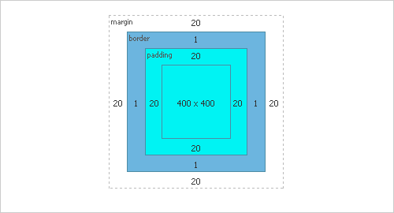

autoscale: true

# Browsers

---

## main browsers
- Chrome
- Internet Explorer
- Firefox
- Safari
- Opera
- Edge

---


---

## Chromium

- Open source Web browser project from which Chrome browser is built
- Opera is now built on Chromium

---

### Why do browsers behave differently? Don't they just have to follow a standard?

---

### The way the browser interprets and displays HTML files is specified by the HTML and CSS specification maintained by WC3, the World Wide Web Consortium

---

# Rendering Engines

---

## Each browser uses its own rendering engine to convert HTML, CSS, and JavaScript to the appropriate rendered image.

- chrome & opera: Blink (fork from Webkit around 2013)
- safari: Webkit2
- firefox: Gecko
- internet explorer: Trident
- edge: EdgeHTML

---

### In the dark ages of Internet Explorer dominance, the IE rendering engine was a black box.

We played by its rules and had no idea what it was doing.

---

### Thankfully, most rendering engines are now open source and much more standardized in their following of the rules laid out by WC3.

---

### Layout engines must parse HTML, CSS, and JavaScript in order to create a DOM tree and render it appropriately.

The layout engine must also be ready to accept changes in the DOM tree based on browser resizing, JavaScript execution, or other events.

---

### Basic initial render flow


---

## Webkit rendering flow


---

## Gecko rendering flow


---

### HTML5 specification says that browsers need to be extremely fault tolerant.

Invalid syntax, which would typically cause an error in a different programming language, must be automatically corrected by the browser's HTML parser.

---

### Parsing HTML efficiently, while also silently "fixing" any errors in syntax, is *extremely complex*.

Each browser handles this differently and may fix errors in different ways.

Typically a browser will never display an error message for invalid HTML. It will simply fix it as best as it can and display the result.

The exception here is that older IE versions or less modern browsers may fail to render anything at all if there is certain invalid HTML syntax.

---

### Invalid HTML
- using a tag that does not exist in HTML specification
- incorrect nesting of tags

```
  <div>
    <p>
      Hi there
    </div>
  </p>
```

---

### How browsers may fix it
- Move `</div>` tag down until it's below the `</p>`
- Add a `</p>` tag before the `</div>`, then add a `<p>` tag before the `</p>` after the div

---

### tables inside of tables

```
  <table>
    <table>
      <tr><td>Inner table</td></tr>
    </table>
    <tr><td>Outer table</td></tr>
  </table>
```

---

### unclosed `<html>` or `<body>` tags

```
  <html>
    <body>
      <p>Cool stuff</p>
```

Modern browsers must be able to handle this (and they can!)

---

### What about `<script>` tags?

---

### Parsers typically halt parsing of the DOM when they encounter a <script> tag and wait for its completion to continue.

Webkit, Blink, Gecko, and EdgeHTML all perform speculative parsing while a script is executing. During script execution, they simultaneously parse the rest of the DOM and look for anymore external requests that need to be made.

Thus they cans send send out asynchronous network requests for these resources all at once, rather than waiting for the initial script to finish before sending out further network requests.

---

### Parsing HTML is *hard*

---

### The layout engine then needs to parse the CSS (easier than HTML)

- Layout engines typically prevent and JavaScript from running until the stylesheets are loaded, so that the JS may access the correct styles.
- Chrome, Safari, and Opera (all using Webkit-based rendering engines) perform optimizations here so that JS is only blocked when the CSS accesses certain styles the JS might need.

---

### before parsing user stylesheets, each browser adds its own default stylesheet to the page

- To get consistent results no matter the browser, load a css reset stylesheet such as [normalize.css](https://necolas.github.io/normalize.css/)

---

### Applying styles properly to the DOM can have huge time and space complexity if not done properly. Each browser addresses this in its own ways.

---

# dev tools

---

### Each browser has its own dev tools and its own features. Experiment with them all and learn the best tools for each type of job.
  - *Chrome*: see live framerates, check load time on all network resources, throttle bandwidth, view in device mode, step through scripts with script debugger...
  - *Firefox*: font inspector, JSON formatter, 3D view for z-index debugging...
  - *Internet Explorer* / *Edge*: Among other things, a memory profiler which proactively identifies detached DOM nodes and other common sources of memory leaks
  - What are your favorite dev tools?

---

# JavaScript Engines

---

> 'The basic job of a JavaScript engine, when all is said and done, is to take the JavaScript code that a developer writes and convert it to fast, optimized code that can be interpreted by a browser or even embedded into an application.'
-- Jen Looper (A Guide To JavaScript Engines for Idiots)

---

### Engines used by major browsers
- Chrome, opera - V8 (this is what Node uses)
- Safari - JavaScriptCore (rebranded as SquirrelFish Extreme, sometimes called Nitro)
- Firefox - SpiderMonkey
- Internet Explorer 8- - JScript (runtime interpreter)
- Internet Explorer 9+ - JScript9 (a version of Chakra with support for old IE quirks)
- Edge - Chakra

---

### The basic job of a JavaScript engine is to analyze, interpret, optimize, allocate memory for, and garbage collect JavaScript code

---

### modern JavaScript engines use "Just in time", or JIT, compilation, which compiles the code on the fly as it's running.

---

### bytecode vs machine code
- machine code is instruction sets specifically for the cpu
- bytecode is code which runs in a generalized virtual machine and must be further compiled to machine code for the specific cpu

---

### JavaScriptCore (Safari)
- parses source code into bytecode, after which four JIT compiler processes kick in and compile/execute the bytecode

---

### V8 (Chrome / Opera)
- uses two compilers to compile your code to machine code as it is executing
  - *full-codegen*: fast compiler that produces unoptimized code
  - *crankshaft*: slower compiler that produces fast, optimized code
- analyzes code after full-codegen has compiled and if it decides the code is too slow, then it replaces the code with an optimized version
- once machine code is produced, the engine exposes all of the ECMAScript functionality to the browser

---


---

### engines consider trade-offs in order to achieve faster results in different scenarios

---

### `Const`

A compiler can optimize the look-up cost for a variable declared using `const` by assuming that it doesn't need to double-check the internal structure of the variable when looking it up.

An Object declared as `const` will remain an Object the next time it is looked up, where an Object declared with `var` is not guaranteed to remain an Object.

---

### Array methods

The Chakra team found `Array#indexOf`, `Array#map` and `Array#forEach` to be the most common built-in Array methods used on the Web.

They specifically targeted improving the performance of these functions in their compiler by avoiding unnecessary trips up the prototype chain when indexes were missing, among other things.

---

# Tips for writing resilient cross-platform Web applications

---

### IE 11 has almost no ES6 functionality, Safari is somewhat under-implemented, and other browsers remain inconsistent in their feature set.

To be safe, you should compile your client-side ES6 code to ES5 before deploying. We typically use [babel](https://babeljs.io/) for this. Hopefully soon, we won't have to.

See [kangax compatibility table](https://kangax.github.io/compat-table/es6/) for complete JS feature list on every browser

---

Understand the CSS box model. Every browser uses it.




---

### Vendor prefixes

Browsers add new experimental CSS features that are only accessible with vendor prefixes. Once the feature is deemed stable it becomes accessible without a prefix.

  - Safari/Chrome/Opera: `-webkit-`
  - Firefox: `-moz-`
  - Old versions of Opera: `-o-`
  - Internet Explorer: `-ie-`

If targeting older browsers you may need to use these prefixes before certain CSS properties.

---

### Transitions and keyframe animations

These are supported by modern browsers (including IE 10 and up)

  `@keyframes` (IE 10 and up, Firefox)
  `@-webkit-keyframes` (chrome, safari, opera which rely on webkit / blink)
  `transition: 1s ease-in-out`


---

### identify which browsers you need to support early on in the project and code with them in mind
- finding out you need to support IE8 after you've written the entire app already would be a nightmare

- Internet Explorer version 8 and before has horrendous JavaScript support
  - doesn't have addEventListener function (attachEvent instead)
  - no Array methods or Object methods
  - avoid writing JS for early IE versions as much as possible

---

### CSS Feature Support

- Go to http://caniuse.com/ and look up the feature you are thinking about using to find out which browsers support it

- Test your features in different browsers - [Browser Stack](https://www.browserstack.com)

---

### Be excited for new features!

*Firefox* now supports css scoping and *Chrome* is implementing it

  - enable in Chrome with "experimental Web Platform features" in `chrome://flags`

```
  <div>
    <style scoped>
      <!-- styles only apply to this div -->
    </style>
  </div>
```

---

CSS `calc` function - perform calculations to determine a CSS property

```
  width: calc(100% / 6);
```


What features are you excited for?

---

## resources

- http://developer.telerik.com/featured/a-guide-to-javascript-engines-for-idiots/
- https://arewefastyet.com/
- http://www.html5rocks.com/en/tutorials/internals/howbrowserswork/ (4 years old but still good)
- http://caniuse.com/
- https://www.browserstack.com
- https://necolas.github.io/normalize.css/
- http://www.w3schools.com/cssref/css3_browsersupport.asp
- https://kangax.github.io/compat-table/es6/

---
