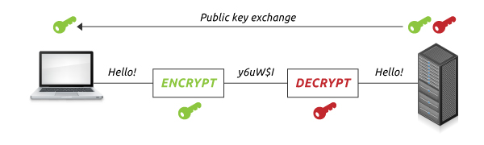

#HTTPS
### (the s stands for secure)

---

#We do not want people reading our messages

---

#How does it work?

---

#Symmetric encryption

---

#Asymmetric encryption

---

#SSL handshake
Asymmetric encryption to create session
Symmetric encryption to transfer messages (faster)

---

#Certificate Verification

---

#HTTPS reduces Man in the Middle Attacks

---

##HTTP Strict Transport Security

##Requires browsers to use HTTPS with site

---

##HTTP Public Key Pinning

##Binds certificate to site

