# What I wish I knew before I started mobile

---

#There are more mobile devices now than there are people
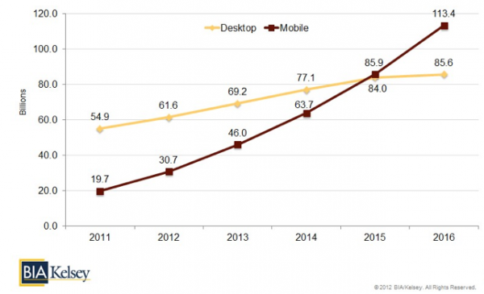

---

# Phone are just mini computers

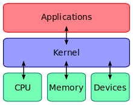

---

# But there are very important considerations

---

# Smaller -> Less resources
- Less RAM and CPU

- Inconsistent access to INTERNET

- Battery life

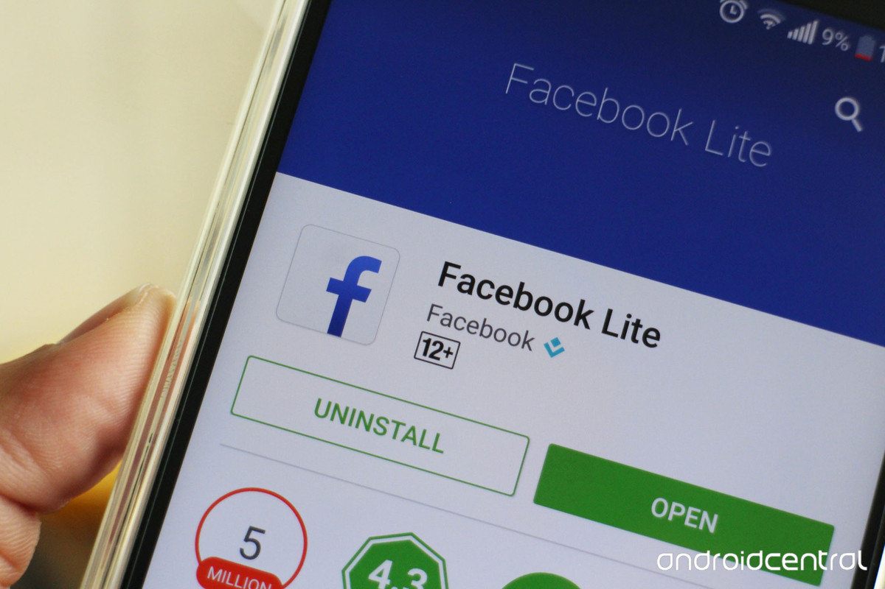

---

# ARM Processor
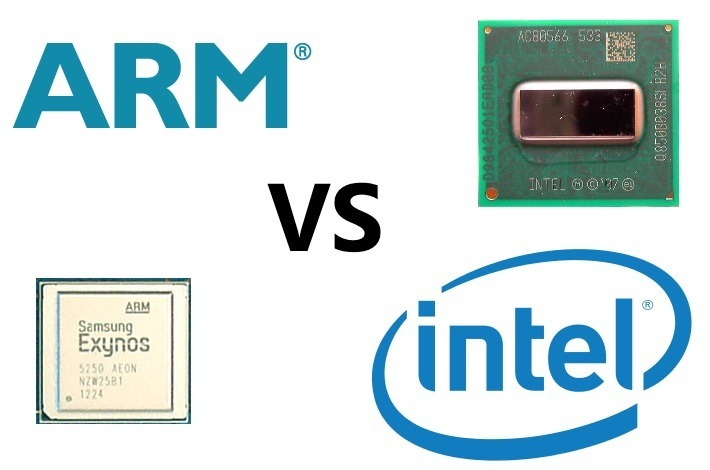

---

# Lifecycle methods control resources

---

# Batch Network Requests

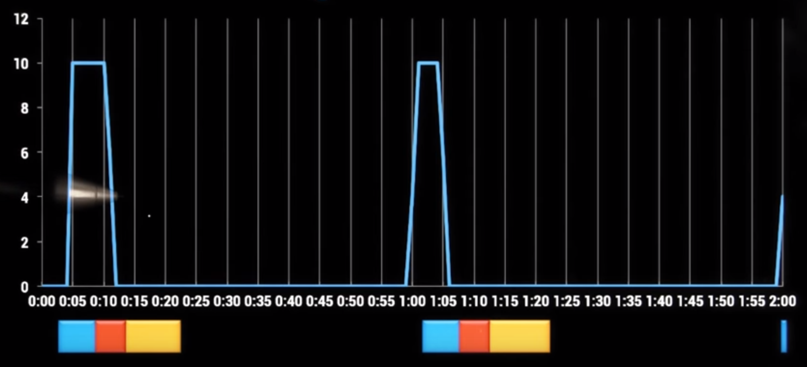

---

# Cool things to interact with

- Gestures
- Camera
- Notification
- GPS

---

#Cool, so how do I start?

---

#Many ways to program

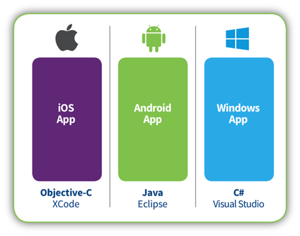
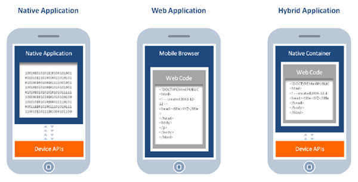

---

# Web Applications
What you are building - target towards phones

 

---

# Hybrid Applications

 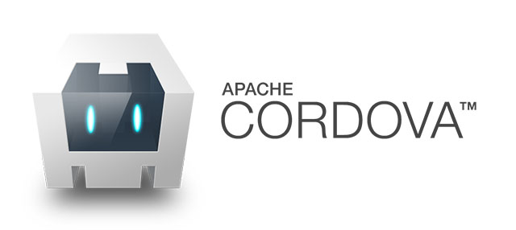

---

# Native Application
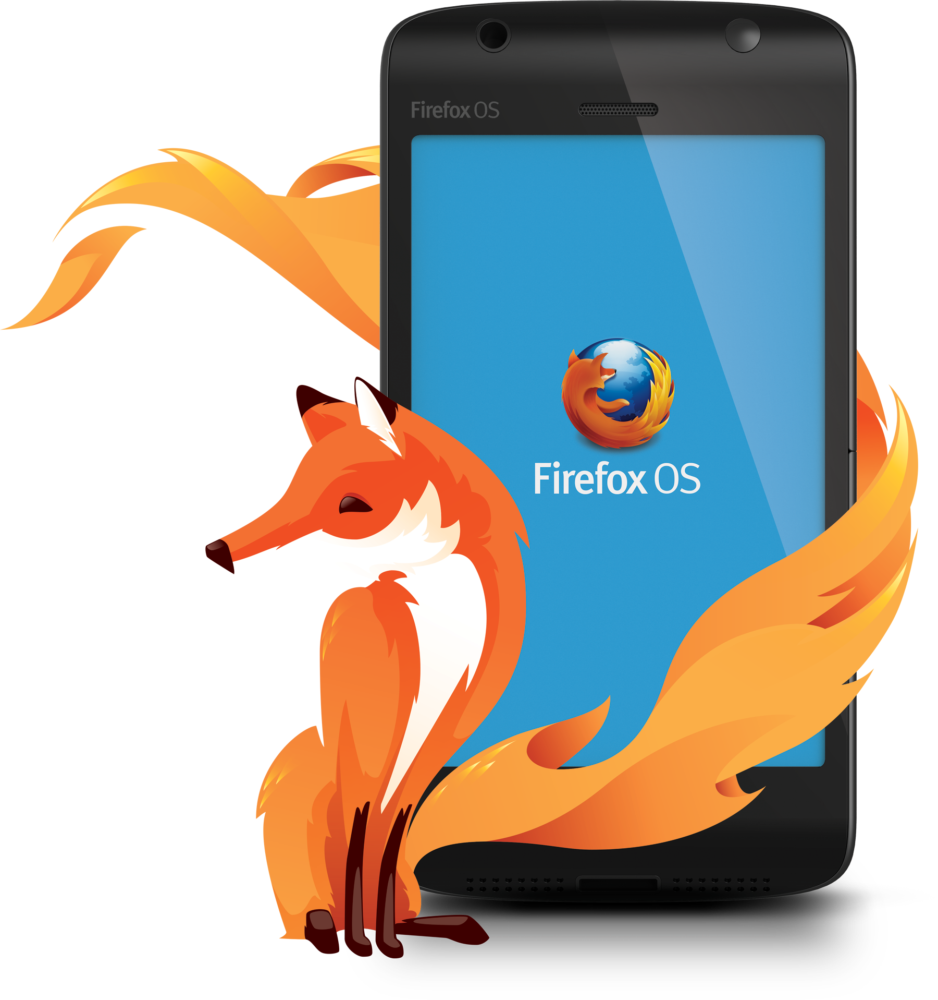 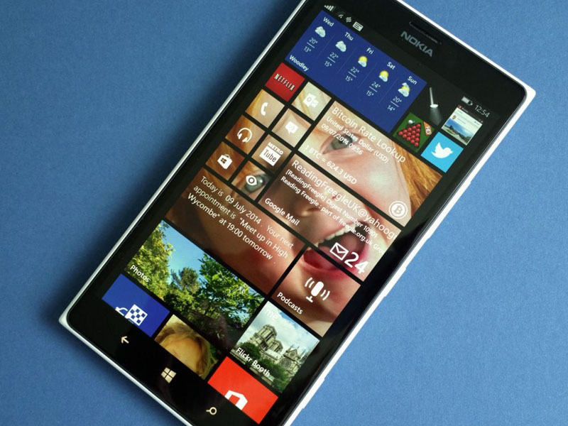
 

---

# Considerations
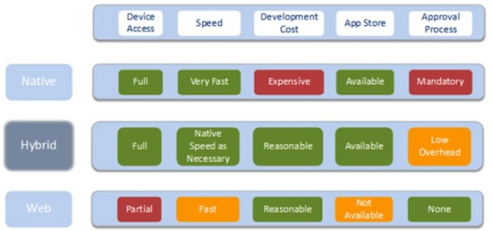

---

#Where does XCode/Eclipse come into this?
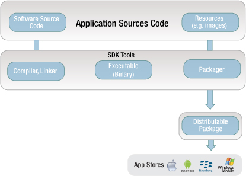

---

# But, I don't know Obj-C or Java

---

# React Native

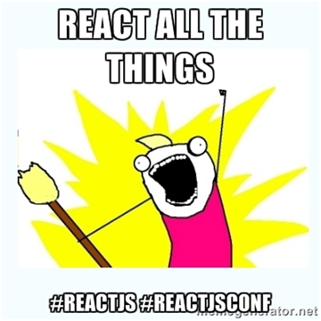

---

---

# Follows the idea of breaking components down into smaller parts
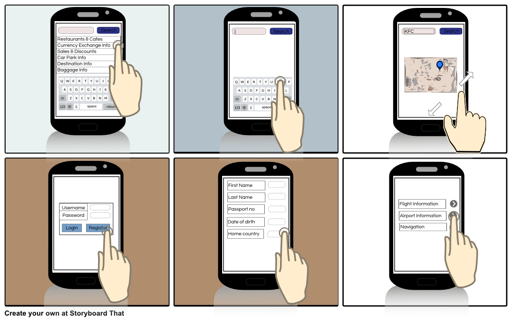

---

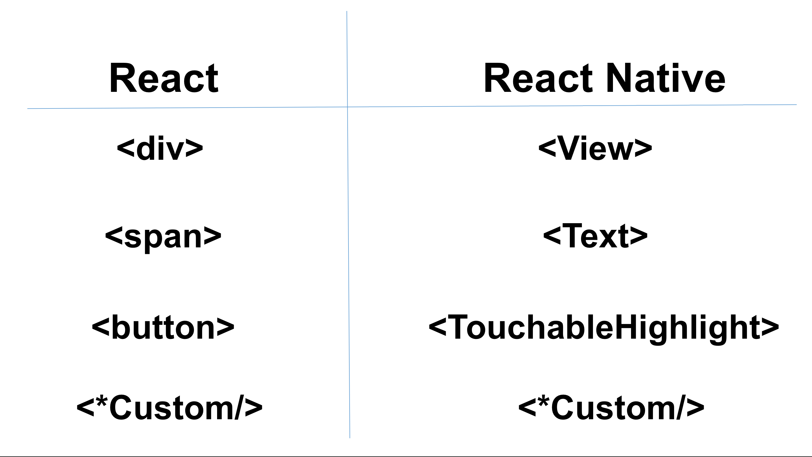

