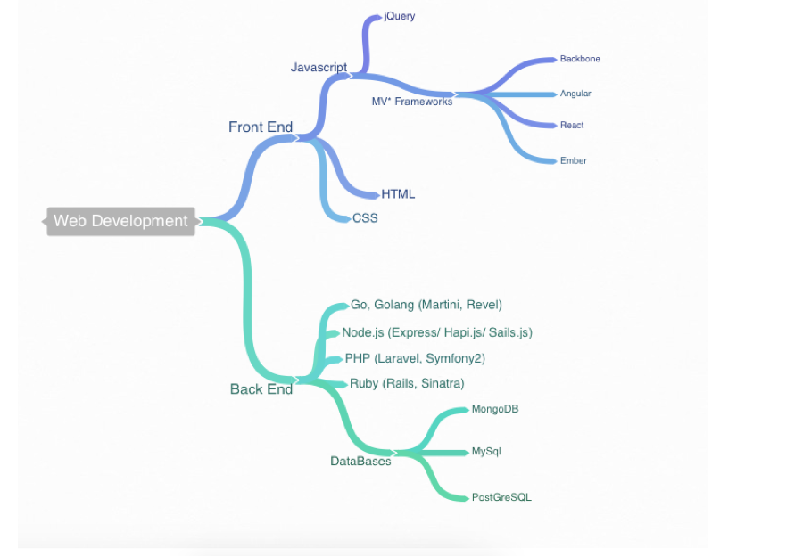

#Web Development
##What is it and what does it take

---

#Why?

Understanding the different technologies that make up web development will help us figure out how everything fits together, that way we can classify other terms we hear and figure out how they fit in the big picture

---

#Web Development is a huge field    

Creating fast, responsive, full-stack, web applications requires a combination of technologies
- HTML
- CSS
- Javascript
- Some type of database

---

---

#Things Split
##Front End vs Back End

---
#Front End
- Is based around what the user sees.
- Heavily influenced on css and appearance

---

#Back End

- Focuses on *Data*.
- Manipulating and creating Data.
- Serving it up in fast efficient ways

---

# Front End vs Back End

- Front end code is sent to the client's PC
  - Html
  - CSS
  - Javascript

- Back end code runs on the server
  - PHP
  - Ruby
  - Javascript

---
#Back End Programming

- Process user input.
- Display pages.
- Structure web applications.
- Interact with permanent storage (SQL, files).

---
#Front End Programming    

- Make interactive webpages.
- Make stuff happen dynamically on the web page.
- Interact with temporary storage, and local storage (Cookies, localStorage).
- Send requests to the server, and retrieve data from it.
