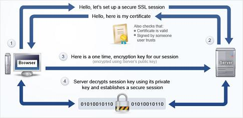

#REST
##Taking a nap

---

#REST    
* A way of architecting your application
* using HTTP
* stateless
* cacheable
* its a standard
* other developers will expect it

---

#RESTFUL APIS

* base URL, like example.com/dogs
* a datatype
* HTTP methods

---

#What does this mean

If i had a url like example.com/dogs/1
and I performed a GET request I would see one dog.
If I performed a DELETE request I would expect that dog to be deleted

---

Its all about linking your APIs representation and use on the internet up with how HTTP works.
Build your APIs to work this way! dont force someone to make a GET request to /delete_dog/1 to erase dog no. 1

---

#Example API    

This API here allows for all the HTTP verbs,
http://jsonplaceholder.typicode.com/posts
you can GET a list of all posts, POST data to create a new post and so on and so forth.

---

#http v https

^http by default listens to 80, https listens to 443

---

