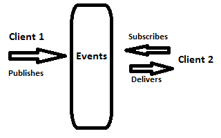

# How do you pass data from one thing to the next?

---

# Socket connection

1. Just a way of sending data form one program to another directly
1. Need to handle failure and drops

---
# Message Queues

have one system that listens for messages, another that sends them.
benefits of this, the code can be any language, on any platform

- ZeroMQ
- RabbitMQ

--- 

---

# In memory database like Redis

- can be used as a key value store
- to hold messages

---

#Why should I care now?

We've just been using child process, which is an entry point to distributed systems, but it might be easier to implement this systems using a message queue

